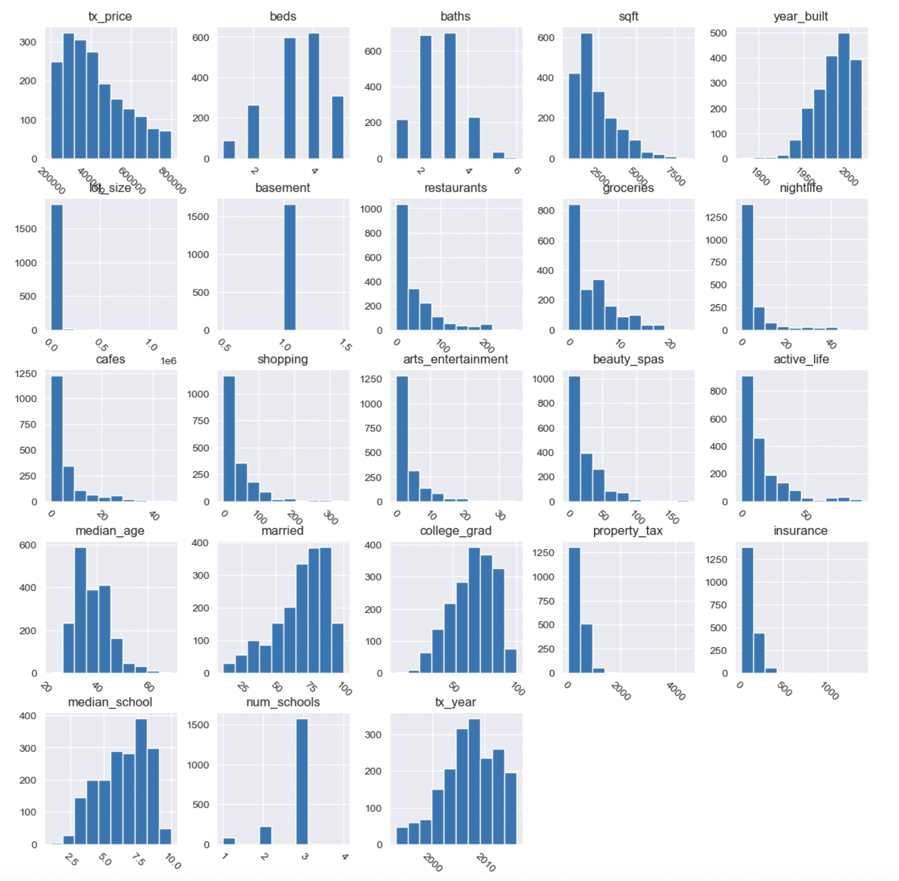
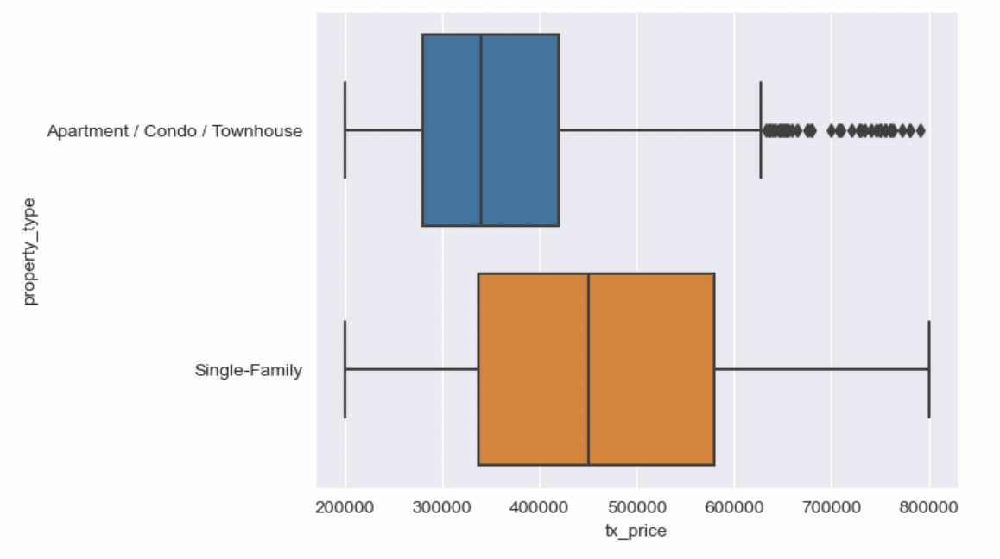
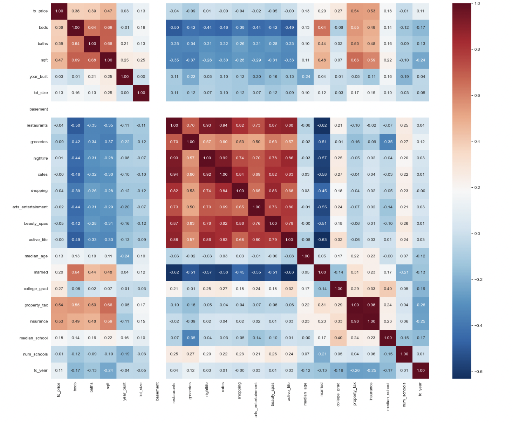
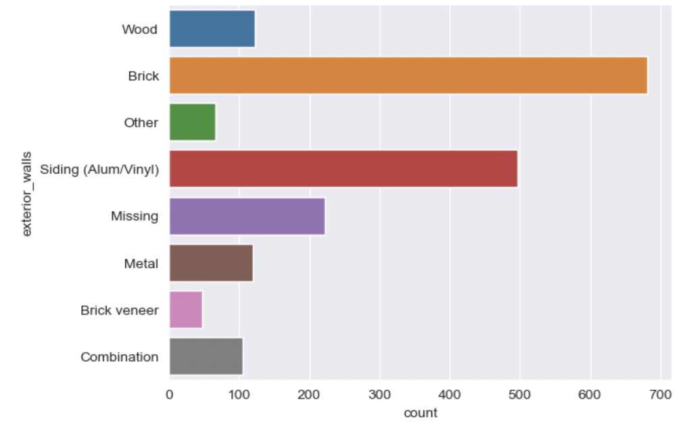
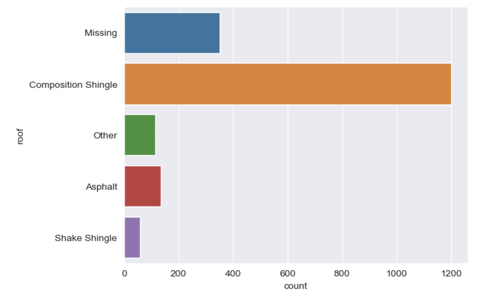
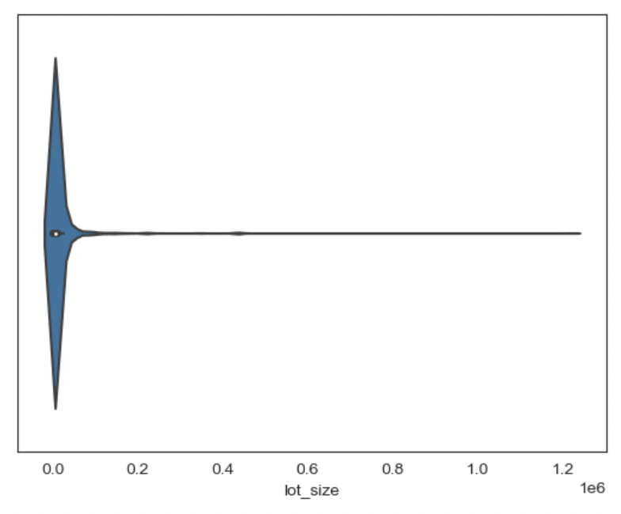
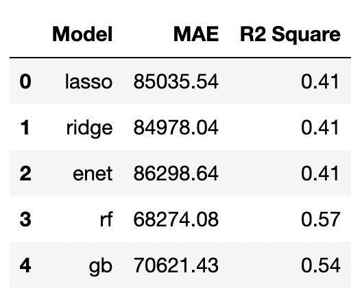
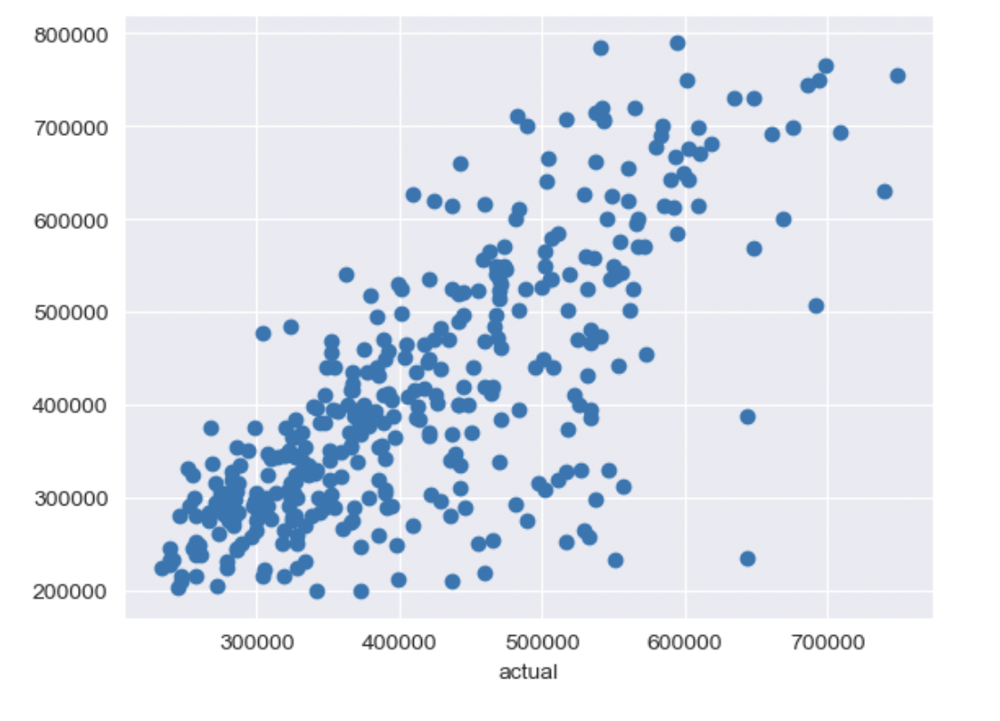

# 🏡 ML-real-estate-prediction

```
Can we build a model to better predict transaction prices of real estate prices?
```

## 💡 Business Background

A leading Real Estate Investment Trust (REIT) in a small county in New York state embarked on a data-driven initiative to modernize their property valuation process. They sought to develop a model that accurately predicts fair transaction prices before property sales, keeping pace with market trends. As a data science consultant, I was tasked with creating a model capable of predicting transaction prices with an average error of less than $70,000. To facilitate this task, the REIT provided an unused dataset from 2016 containing transaction prices of properties in their area of operation.

## 📈 Machine Learning Background

* The dataset has 1883 observations in the county where the REIT operates.
* Each observation is for the transaction of one property only.
* Each transaction was between $200,000 and $800,000.
* Target Variable: Transaction Price
* Input Features: 22 independent variable including `Public records for the property`, `Property characteristics`, `Location convenience scores`, `Neighborhood demographics`, `Schools`
* Machine Learning Task: Regression
* Win Condition: Mean Absolute Error (MAE) < $70,000

## 🚀 Getting Started

To begin, set up the environment for running the Jupyter Notebook file, ensuring the necessary library versions. Download the data and the .ipynb file, and load the required libraries and data into the notebook. Finally, execute the entire notebook by selecting "Run All".

## 🎨 Exploratory Data Analysis / Data Cleaning / Feature Engineering

I performed data cleaning, exploratory data analysis, and feature engineering using the [Real Estate Prediction - Data Cleaning, Exploratory Analysis, & Feature Engineering.ipynb](https://github.com/yamachang/ML-real-estate-prediction/blob/main/Real%20Estate%20Prediction%20-%20Data%20Cleaning%2C%20Exploratory%20Analysis%2C%20%26%20Feature%20Engineering.ipynb) notebook. The process involved various plots to assess distributions, segmentations, correlations, and outliers. Data cleaning tasks included dropping unwanted observations, rectifying structural errors, eliminating outliers, and addressing missing data. Feature engineering encompassed creating new features, grouping sparse classes, and creating dummy variables for categorical features.

### Summary Statistics

**Preliminary analysis and visualizations were conducted to gain insights into the data. Here are some of the key findings:**

* **Histograms** were used to understand the distribution of variables and identify any sparse data.
  
<p align="center">
  
</p>

* **Box plots** were employed to examine the relationship between categorical and numeric features. In general, it looks like single family homes are more expensive than apartments.

<p align="center">
  
</p>
  
* **The correlation matrix** was visualized to explore the relationships between numeric features.

<p align="center">
  
</p>

**Next, we aimed to perform data cleaning tasks, which involved **grouping sparse data** to mitigate overfitting and **checking for outliers**.**

* **Grouping sparse data**: For categorical features, we reduced the number of items in `exterior_walls` from 16 to 8, and in `roof` from 16 to 5.

<div style="display:flex; justify-content:center;">
  
  
</div>

* **Checking for outliers**: It looks like `lot_size` has a potential outlier as it has a long and skinny tail, and we decided to remove observations with `lot_size` greater than 500,000 sqft for outliers.

<p align="center">
  
</p>

## 🧵 Predicting House Prices using Regression Models

Regression analysis was chosen as the optimal approach for predicting continuous house prices based on multiple independent variables.

Prior to training the models, preprocessing was performed. Standardization, a common technique in machine learning, was applied to ensure all features were on the same scale. This involved subtracting means and dividing by standard deviations. The preprocessing step was included in cross-validation.

After splitting the data into training and test sets, the training set was used to train three types of regression models (Ridge, Lasso, and Elastic Net Regression) as well as two ensembling models (Random Forest and Gradient Boosting Trees).

Next, hyperparameters for each model were tuned accordingly before fitting the training model. For Lasso and Ridge regularized regression, the strength of the penalty was the most impactful hyperparameter. In the case of Elastic Nets, tuning was done for the alpha parameter, along with the addition of a new hyperparameter called `l1_ratio`. For Random Forest, the number of decision trees (`n_estimators`) and the maximum number of features each tree can choose from (`max_features`) were tuned. Lastly, for Gradient Boosting Trees, tuning was done for `n_estimators`, `learning_rate`, and `max_depth`.

The evaluation of the models is shown in the plot below:

<p align="left">
  
</p>

Analyzing the metrics, we observed that Random Forest achieved the highest R2 score and the lowest MAE. While Gradient Boosting Tree showed the best holdout R2 score during cross-validation, Random Forest's performance was only slightly lower. Importantly, Random Forest met the win condition of the project with an MAE below $70,000.

In conclusion, let's visualize the performance of the winning model on the test set.

<p align="left">
  
</p>

## 📍 Takeaways and Next Steps

The ML-real-estate-prediction project aimed to develop a model to predict transaction prices for real estate properties. By leveraging regression models and extensive data analysis, we successfully achieved a model with an MAE below the project's win condition of $70,000. Here are some key takeaways:

*Data Science Perspective:*

* Random Forest emerged as the top-performing model, showcasing the highest R2 score and lowest MAE.
* Careful feature engineering, including creating new features and grouping sparse classes, improved prediction performance.
* Preprocessing steps, such as standardization and outlier handling, addressed overfitting and ensured reliable generalization.

*Business Perspective:*

* Improved Pricing Strategy: Accurate predictions optimize pricing decisions, maximizing profits and competitiveness.
* Risk Mitigation: Accurate estimates aid in informed investment decisions, minimizing overpaying or undervaluing properties.
* Cost Reduction: Accurate predictions reduce the need for costly manual appraisals, streamlining operations.

*Next Steps:*

* Deploy the Winning Model: Deploy the trained Random Forest model for real-time price prediction.
* Continuous Model Monitoring: Regularly monitor and update the model with new data for sustained accuracy.
* Incorporate External Data: Explore incorporating economic indicators and demographic data for enhanced predictions.
* Evaluate Model Robustness: Conduct stress testing under different scenarios to ensure model performance.
* Collaborate with Stakeholders: Gather feedback and refine the model in collaboration with the REIT and industry professionals.

Implementing these next steps will further improve the accuracy and usefulness of the real estate price prediction model, enabling informed decisions and optimized property valuation processes.
